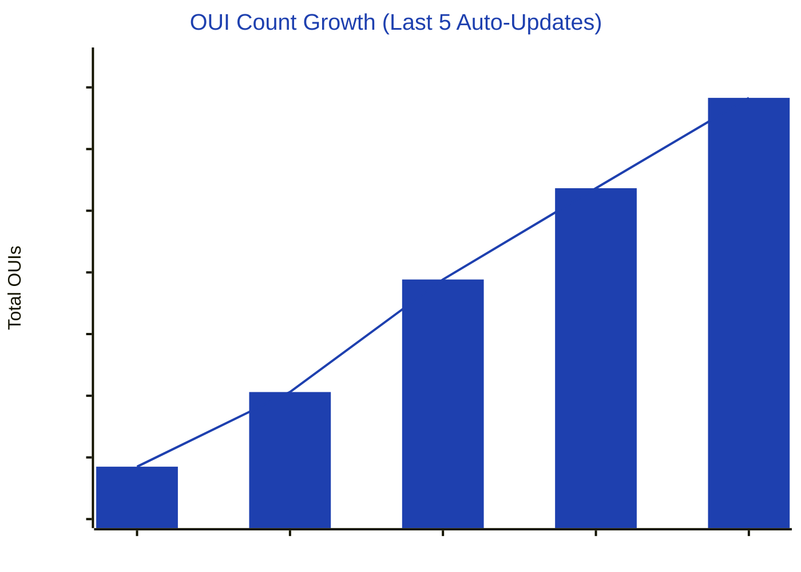
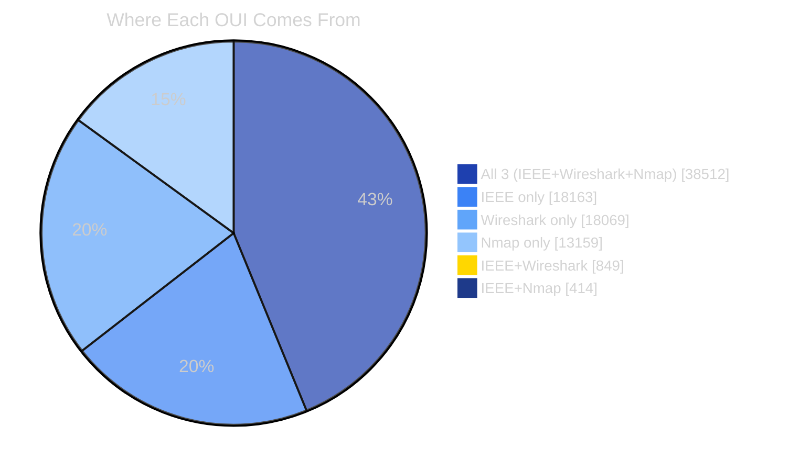
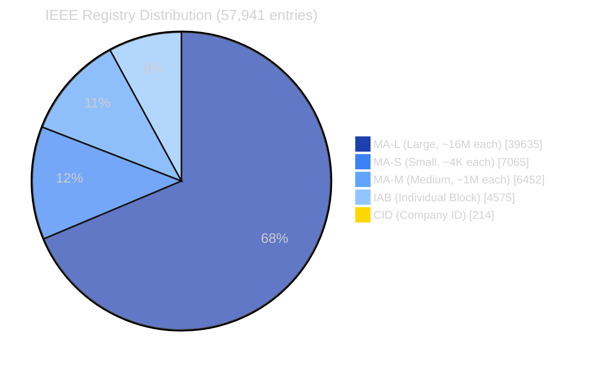
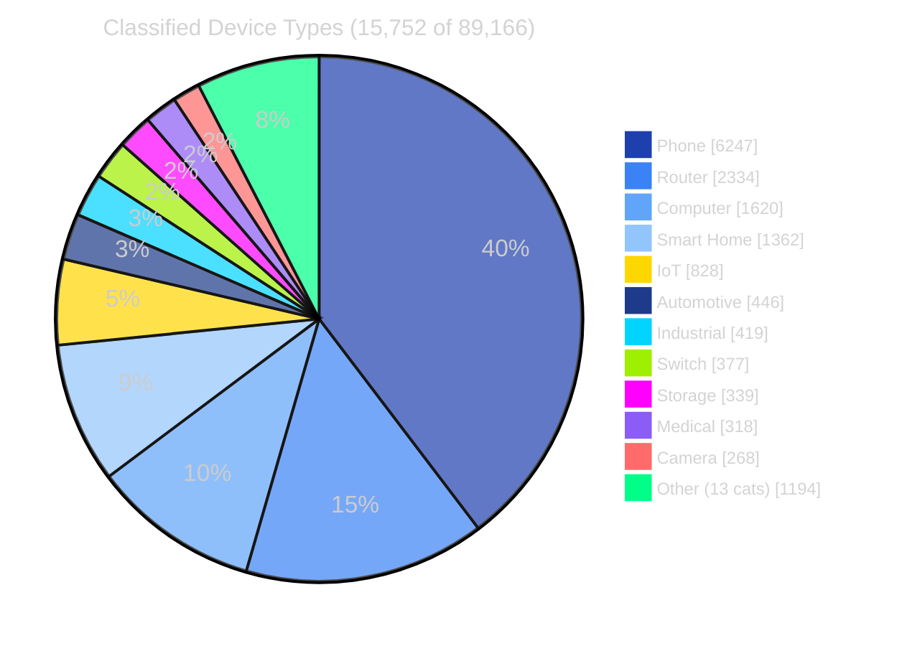
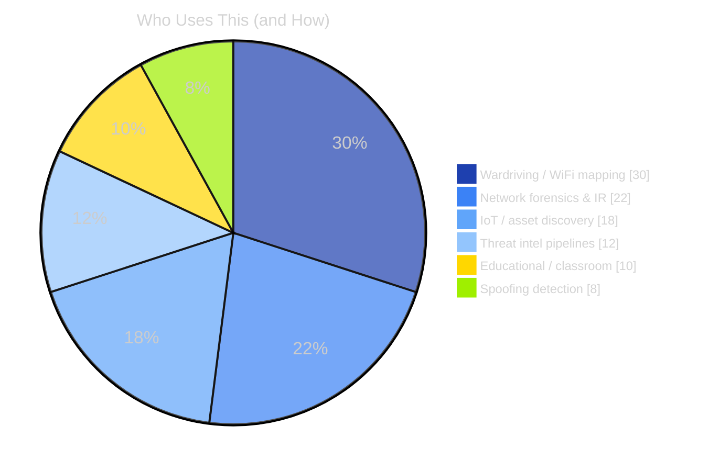

<div align="center">


[](https://git.io/typing-svg)

<br>

[](LISTS/master_oui.csv)
[](#ls-lists)
[](#update_schedule)
[](#license)
[](https://ringmast4r.github.io/OUI-Master-Database/)

[](https://github.com/Ringmast4r/OUI-Master-Database/stargazers)
[](https://github.com/Ringmast4r/OUI-Master-Database/network/members)
[](#)
[](https://github.com/Ringmast4r/OUI-Master-Database/commits/master)
[](#)


---

## `> what_is_this`

<!-- AUTO:WHAT_IS_THIS -->
```bash
ringmast4r@github:~$ cat oui-master-db.txt

  PURPOSE:        MAC address vendor lookup, the comprehensive way
  SCOPE:          Every IEEE registry + Wireshark + Nmap + HDM Mac-Tracker
  COVERAGE:       89,166 unique OUIs, 78,290 cross-validated entries
  FORMATS:        TXT, CSV, TSV, JSON, JSON-min, XML, SQLite, SQL, Kismet, Kismet.gz
  UPDATES:        First of every month via GitHub Actions
  USE CASES:      Wardriving | Network forensics | IoT discovery | Threat intel

  STATUS:         [ LIVE & AUTO-UPDATING ]
```
<!-- /AUTO:WHAT_IS_THIS -->

> **OUI** = the first 3 bytes of a MAC address that identifies the manufacturer.
> Most lookup databases pick *one* source. We merged *all of them*.

---

## `> stats --live`

<div align="center">

<!-- AUTO:STATS_TABLE -->
| METRIC | COUNT | NOTES |
|:------:|:-----:|:-----:|
| **Total Unique OUIs** | `89,166` | Deduplicated across 4 sources |
| **Cross-Validated** | `78,290` | Same OUI from multiple sources |
| **IEEE Registry Total** | `57,941` | MA-L + MA-M + MA-S + IAB + CID |
| **Device Categories** | `24` | Auto-classified |
| **File Formats** | `10` | TXT to SQLite |
| **Monthly New OUIs** | `~324` | IEEE assignments |
<!-- /AUTO:STATS_TABLE -->

</div>

---

## `> growth --monthly`

<div align="center">

<!-- AUTO:GROWTH_CHART -->


**+1,196 OUIs in ~16 weeks** · IEEE assigns roughly **324 new vendors/month** · Next refresh: **first of next month**
<!-- /AUTO:GROWTH_CHART -->

</div>

---

## `> sources --breakdown`

<div align="center">

<!-- AUTO:SOURCES_PIE -->


**38,512 OUIs (43%)** are confirmed by all three primary sources. The remaining single-source entries
fill gaps that *no individual database* would catch on its own. That's the point.
<!-- /AUTO:SOURCES_PIE -->

</div>

### Source Roster

<!-- AUTO:SOURCE_ROSTER -->
| SOURCE | ENTRIES | LICENSE | URL |
|:-------|:-------:|:-------:|:----|
|  | `57,941` | Public Domain | [standards-oui.ieee.org](https://standards-oui.ieee.org/) |
|  | `57,430` | GPLv2 | [wireshark.org](https://www.wireshark.org/download/automated/data/manuf.gz) |
|  | `52,085` | GPLv2 (mod.) | [nmap-mac-prefixes](https://github.com/nmap/nmap/raw/master/nmap-mac-prefixes) |
|  | `58,058` | MIT | [hdm/mac-tracker](https://github.com/hdm/mac-tracker) |
<!-- /AUTO:SOURCE_ROSTER -->

---

## `> registries --ieee`

<div align="center">

<!-- AUTO:IEEE_PIE -->

<!-- /AUTO:IEEE_PIE -->

<!-- AUTO:IEEE_TABLE -->
| REGISTRY | ENTRIES | BLOCK SIZE | TYPICAL USE |
|:--------:|:-------:|:----------:|:------------|
| **MA-L** | `39,635` | 24-bit (~16M MACs) | Large-scale manufacturers |
| **MA-S** | `7,065`  | 36-bit (~4K MACs) | IoT, niche hardware |
| **MA-M** | `6,452`  | 28-bit (~1M MACs) | Mid-volume vendors |
| **IAB**  | `4,575`  | Individual | Legacy individual blocks |
| **CID**  | `214`    | Company-only ID | Non-MAC company markers |
<!-- /AUTO:IEEE_TABLE -->

</div>

---

## `> classification --devices`

<!-- AUTO:DEVICE_CAVEAT -->
> ⚠ IEEE doesn't expose device category. Our classifier is a heuristic on company name +
> known-vendor lookups, so **only 15,752 of 89,166 OUIs** (17.7%) get a category. The
> remaining 73,414 stay `Unclassified` rather than guessed.
<!-- /AUTO:DEVICE_CAVEAT -->

<div align="center">

<!-- AUTO:DEVICE_PIE -->

<!-- /AUTO:DEVICE_PIE -->

</div>

<details>
<summary><b>Full device-type table (24 categories)</b></summary>

<!-- AUTO:DEVICE_TABLE -->
| CATEGORY | COUNT | CATEGORY | COUNT |
|:---------|:-----:|:---------|:-----:|
| Phone        | `6,247` | Media Player | `168` |
| Router       | `2,334` | Gaming       | `166` |
| Computer     | `1,620` | VoIP         | `143` |
| Smart Home   | `1,362` | Appliance    | `141` |
| IoT          | `828` | Printer      | `113` |
| Automotive   | `446` | Access Point | `59` |
| Industrial   | `419` | Server       | `58` |
| Switch       | `377` | Wearable     | `51` |
| Storage      | `339` | Audio        | `35` |
| Medical      | `318` | Modem        | `27` |
| Camera       | `268` | Thermostat   | `23` |
| TV           | `203` | Tablet       | `7` |
<!-- /AUTO:DEVICE_TABLE -->

</details>

---

## `> demo --live`

<div align="center">

[](https://ringmast4r.github.io/OUI-Master-Database/)

Search by **MAC address** or **manufacturer name**. Runs entirely in your browser. No tracking.

</div>

---

## `> example`

```
MAC Address:  3C:D9:2B:12:34:56
              └─OUI─┘ └─Device─┘

OUI:          3C:D9:2B
Manufacturer: Hewlett Packard
Device Type:  Computer
Country:      US
Registry:     MA-L
Sources:      IEEE + Wireshark + Nmap
```

**Why this matters:**
- Identify rogue/unauthorized devices on your network
- Categorize WiFi APs by vendor while wardriving
- Discover IoT devices, cameras, printers across a subnet
- Detect MAC spoofing (compare OUI registry vs claimed vendor)

---

## `> ls LISTS/`

### Direct Downloads

<div align="center">

| FORMAT | SIZE | BEST FOR | DOWNLOAD |
|:------:|:----:|:---------|:--------:|
|  | minimal | `grep`/`awk`, legacy tools | [master_oui.txt](LISTS/master_oui.txt) |
|  | full | Spreadsheets, dataframes | [master_oui.csv](LISTS/master_oui.csv) |
|  | medium | Excel/Sheets (no quote issues) | [master_oui.tsv](LISTS/master_oui.tsv) |
|  | pretty | APIs, human-readable | [master_oui.json](LISTS/master_oui.json) |
|  | compact | Scripts, fast loading | [master_oui.min.json](LISTS/master_oui.min.json) |
|  | enterprise | Java, XSLT | [master_oui.xml](LISTS/master_oui.xml) |
|  | indexed | Ready-to-query DB | [master_oui.db](LISTS/master_oui.db) |
|  | script | Postgres/MySQL/D1 import | [import-to-d1.sql](LISTS/import-to-d1.sql) |
|  | text | Kismet wireless IDS | [kismet_manuf.txt](LISTS/kismet_manuf.txt) |
|  | compressed | Kismet drop-in install | [kismet_manuf.txt.gz](LISTS/kismet_manuf.txt.gz) |

</div>

### Raw URLs (cron / curl friendly)

```bash
https://raw.githubusercontent.com/Ringmast4r/OUI-Master-Database/master/LISTS/master_oui.txt
https://raw.githubusercontent.com/Ringmast4r/OUI-Master-Database/master/LISTS/master_oui.csv
https://raw.githubusercontent.com/Ringmast4r/OUI-Master-Database/master/LISTS/master_oui.json
https://raw.githubusercontent.com/Ringmast4r/OUI-Master-Database/master/LISTS/master_oui.db
```

---

## `> data_fields`

| FIELD | TYPE | EXAMPLE |
|:------|:----:|:--------|
| `oui` | string | `3C:D9:2B` |
| `manufacturer` | string | `Hewlett Packard` |
| `short_name` | string | `HP` |
| `registry` | enum | `MA-L`, `MA-M`, `MA-S`, `IAB`, `CID` |
| `device_type` | enum | `Router`, `Phone`, `Camera`, `IoT`, ... |
| `address` | string | `11445 Compaq Center Dr, Houston TX US` |
| `country` | iso2 | `US`, `CN`, `DE`, `JP` |
| `registered_date` | date | `2012-05-15` |
| `sources` | array | `["IEEE","Wireshark","Nmap"]` |

---

## `> usage`

### `python`

```python
import json

with open('LISTS/master_oui.min.json') as f:
    db = json.load(f)

def lookup(mac):
    oui = mac[:8].upper()
    return db.get(oui, {'manufacturer': 'Unknown'})

print(lookup('00:00:0C:12:34:56'))
# {'manufacturer': 'Cisco Systems, Inc', 'device_type': 'Router', 'country': 'US'}
```

### `node.js`

```javascript
const db = require('./LISTS/master_oui.json');
const lookup = mac => db[mac.substring(0,8).toUpperCase()] || { manufacturer: 'Unknown' };
console.log(lookup('00:00:0C:12:34:56'));
```

### `sqlite3`

```bash
sqlite3 LISTS/master_oui.db "SELECT * FROM oui_registry WHERE oui = '00:00:0C'"
sqlite3 LISTS/master_oui.db "SELECT device_type, COUNT(*) FROM oui_registry GROUP BY device_type ORDER BY 2 DESC"
```

### `grep` (TXT)

```bash
grep "3CD92B" LISTS/master_oui.txt
grep -i "apple" LISTS/master_oui.txt | head
```

### `curl` (one-liner)

```bash
curl -s https://raw.githubusercontent.com/Ringmast4r/OUI-Master-Database/master/LISTS/master_oui.txt | grep -i "00000C"
```

---

## `> cli_tool`

Cross-platform Node.js CLI in [`CLI TOOL/`](CLI%20TOOL/) — works on **Windows / Linux / macOS**.

```bash
cd "CLI TOOL"
node oui-lookup.js --interactive          # Continuous lookup REPL
node oui-lookup.js 00:00:0C:12:34:56      # Single lookup
node oui-lookup.js --search cisco         # Search by manufacturer
node oui-lookup.js --wifi                 # Scan nearby WiFi + show vendors
node oui-lookup.js --bluetooth            # Scan BT devices + show vendors
node oui-lookup.js --arp                  # Local ARP table with vendors
node oui-lookup.js --stats                # Database statistics
```

| FEATURE | WIN | LINUX | MAC |
|:--------|:---:|:-----:|:---:|
| WiFi Scan | `netsh wlan` | `nmcli` | `airport` |
| Bluetooth | PowerShell | `bluetoothctl` | `system_profiler` |
| ARP Table | `arp -a` | `arp -a` | `arp -a` |

---

## `> generate --fresh`

```bash
git clone https://github.com/Ringmast4r/OUI-Master-Database.git
cd OUI-Master-Database
npm install

bash download-sources.sh        # Pulls IEEE + Wireshark + Nmap + HDM
node merge-oui-databases.js     # Merges into LISTS/master_oui.*
```

**Windows:** double-click [`update-database.bat`](update-database.bat).

---

## `> update_schedule`

The repo auto-updates on a **monthly cron** via GitHub Actions:

```
.github/workflows/update.yml -> runs at 02:00 UTC on the 1st of each month
```

Why monthly and not weekly? IEEE assigns ~300-400 OUIs/month. Polling more often
just generates churn for marginal freshness on a slow-moving registry.

To self-host updates:

```cron
0 0 1 * * cd /path/to/OUI-Master-Database && bash download-sources.sh && node merge-oui-databases.js
```

---

## `> use_cases`



---

## `> credits`

Combining four authoritative sources, with respect for each license:

- **IEEE Registration Authority** · public domain · [standards-oui.ieee.org](https://standards-oui.ieee.org/)
- **Wireshark Manufacturer DB** · GPLv2 · [wireshark.org](https://www.wireshark.org/)
- **Nmap MAC Prefixes** · modified GPLv2 · [nmap.org](https://nmap.org/)
- **HDM Mac-Tracker** · MIT · [hdm/mac-tracker](https://github.com/hdm/mac-tracker)

This project is **MIT** — use commercially, modify, redistribute, embed in proprietary tools.

---

## `> related_projects`

[](https://wifimothership.com/)
[](https://github.com/Ringmast4r/FLOCK)
[](https://github.com/Ringmast4r/Tower-Hunter)
[](https://github.com/Ringmast4r/MAC-SPOOFER)

---

## `> contributing`

Issues and PRs welcome. Most-wanted contributions:

- Better device-type heuristics (we're at 17.6% classified; let's get to 30%+)
- Country-code derivation from address strings
- Additional authoritative sources beyond the current four
- API wrapper libraries (Go, Rust, Ruby)

---

<!-- AUTO:FOOTER -->
**Last updated:** `2026-06-29` · **Total OUIs:** `89,166` · **Maintained by** [@Ringmast4r](https://github.com/Ringmast4r)
<!-- /AUTO:FOOTER -->


</div>
